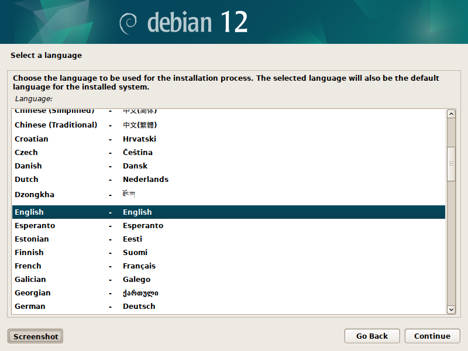
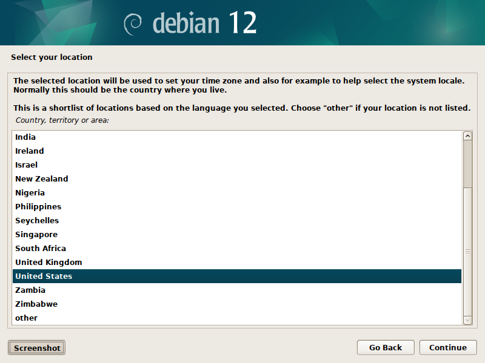
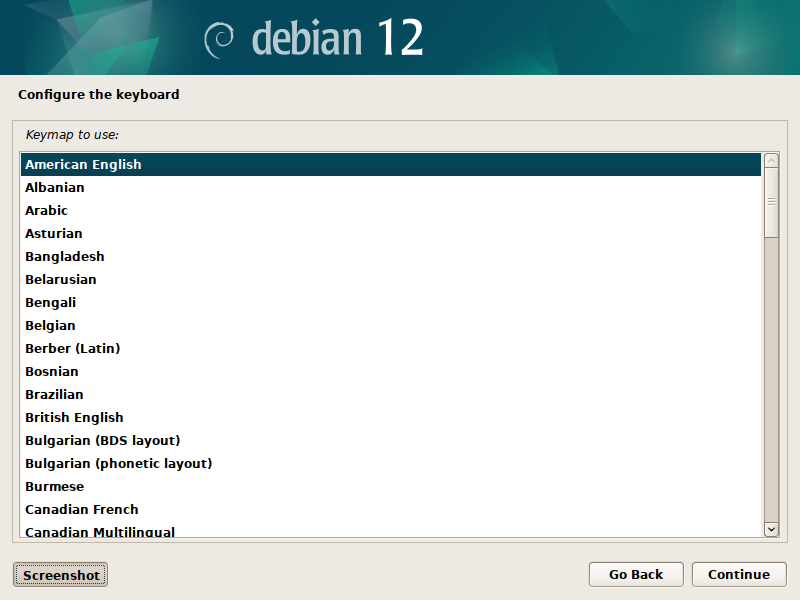
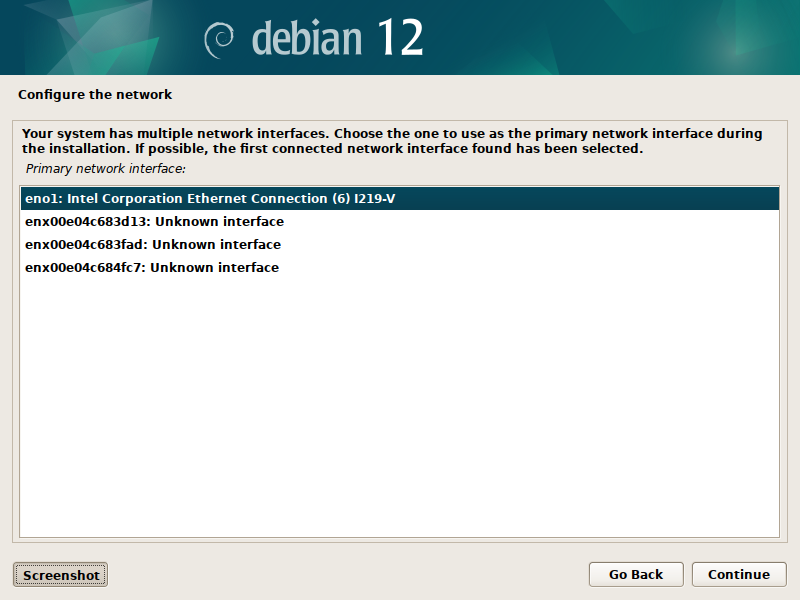
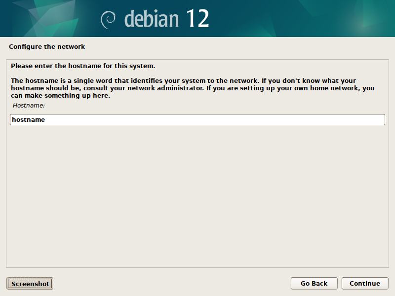
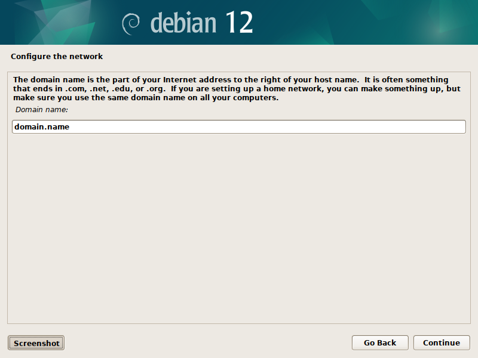
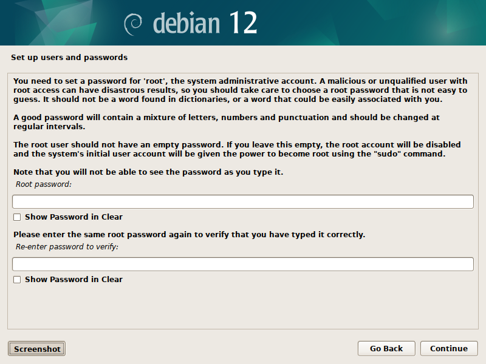

# Debian Installation

Debian is a good choice for an operating system within a homelab due to its stability, security, and extensive software repository. It's known for its conservative approach to updates, prioritizing reliability over bleeding-edge features, which is ideal for a homelab environment where consistency is crucial. Additionally, Debian has robust community support and thorough documentation, making it easier to troubleshoot and customize your homelab setup.

*This reference assumes that a boot drive with [Debian](https://www.debian.org/intro/about) has already been created.*

---

## Installation Configuration

To being the installation configuration, choose the **graphical installation** option out of the list. Other options are permitted, however, this guide follows the graphical installation process.

---

### Select a Language

During this step, select which language you would like to use for the installation process. The chosen language will also be used as the default language for the installed sytem.

---

### Select your Location

During this step, select the location of the server. This location will be used to set the timezone.

---

### Configure your Keyboard

During this step, select the keymapping to use on the system.

---

### Configure the Network

During this step, the system will attempt to identify all usable Network Interface Controllers (NICs). Select which NIC you would like to use as the primry interface for the system.

---

### Configure System Hostname

After selecting the primary NIC, the system will attempt to use DHCP to configure the system hostname. Enter the hostname you would like to use or hit continue if it was properly found during DHCP.

---

### Configure System Domain Name

After selecting the primary NIC, the system will attempt to use DHCP to configure the system domain name. Enter the domain name you would like to use or hit continue if it was properly found during DHCP.

---

### Configure Root User Password

For the purposes of following other guides within this repository. It is recommended to NOT set the root user password. This will disable root login and will instead allow other users sudo privilege. To skip setting the root password, simply do not fill in the fields and hit continue.

---
