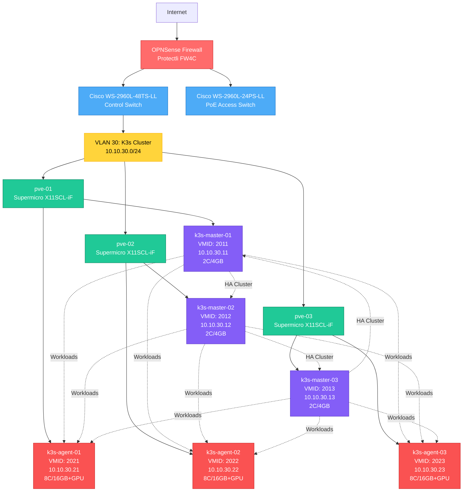

<!-- cspell:ignore Protectli OPNSense Proxmox VLANs hostpci -->

# Network Topology

This page provides a visual representation of the homelab network infrastructure, showing the hierarchical relationship between network devices, physical hosts, and virtual machines.

## Infrastructure Overview

The homelab uses a layered architecture with dedicated VLANs for traffic segmentation. The core infrastructure includes:

- **Edge**: OPNSense firewall (Protectli FW4C) providing routing and security
- **Distribution**: Cisco switches for VLAN management and connectivity
- **Compute**: Proxmox VE cluster (3 nodes) hosting virtual machines
- **Workload**: K3s Kubernetes cluster (HA configuration with 3 masters + 3 agents)

## Network Topology Diagram

## Key Components

### Edge Security

- **OPNSense Firewall (Protectli FW4C)**: Provides network edge security, routing between VLANs, and internet connectivity

### Network Distribution

- **Cisco WS-2960L-48TS-LL**: Primary control switch for inter-VLAN routing and trunk connections
- **Cisco WS-2960L-24PS-LL**: PoE-capable access switch for powered devices

### VLAN Segmentation

- **VLAN 30 (10.10.30.0/24)**: Dedicated network for Kubernetes cluster traffic, isolated from other homelab VLANs

### Compute Layer (Proxmox VE)

- **pve-01, pve-02, pve-03**: Three-node Proxmox cluster providing high availability and distributed compute resources
- Each node runs:
  - 1x K3s master (control plane)
  - 1x K3s agent (worker node with GPU passthrough)

### Kubernetes Cluster (K3s)

**Control Plane (Masters):**

- **k3s-master-01** (VMID 2011): Control plane node on pve-01
- **k3s-master-02** (VMID 2012): Control plane node on pve-02
- **k3s-master-03** (VMID 2013): Control plane node on pve-03

**Worker Nodes (Agents):**

- **k3s-agent-01** (VMID 2021): Worker node on pve-01 with GPU passthrough (hostpci0)
- **k3s-agent-02** (VMID 2022): Worker node on pve-02 with GPU passthrough (hostpci0)
- **k3s-agent-03** (VMID 2023): Worker node on pve-03 with GPU passthrough (hostpci0)

## High Availability Design

The infrastructure is designed for high availability:

1. **Distributed Masters**: K3s control plane nodes are spread across all three Proxmox hosts
2. **Distributed Workers**: K3s agents are evenly distributed to balance workload
3. **Node Failure Tolerance**: Loss of any single Proxmox node leaves cluster operational with 2/3 masters and 2/3 agents
4. **Network Redundancy**: Multiple switches provide failover capability

## GPU Passthrough

All K3s agent nodes have Intel integrated GPUs passed through via PCI passthrough (hostpci0 = 0000:00:02.0). This enables:

- Hardware-accelerated media transcoding
- ML/AI workloads
- Video processing applications

## Related Documentation

- [Network Reference](network-reference.md) - Detailed VLAN and network configuration
- [Naming Conventions](../../../concepts/naming-conventions.md) - VM naming, ID ranges, and resource allocation
- [Hardware Reference](../hardware/hardware-reference.md) - Physical server specifications
- [Proxmox Cluster Setup](../../../setup/proxmox/proxmox-cluster-setup.md) - Cluster installation guide
